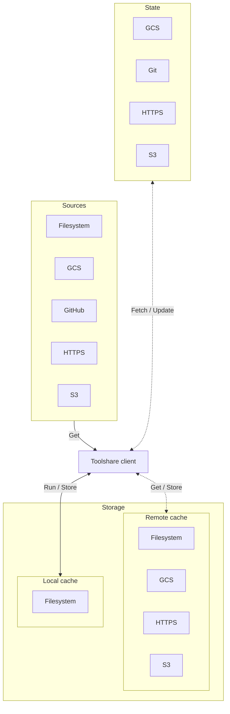
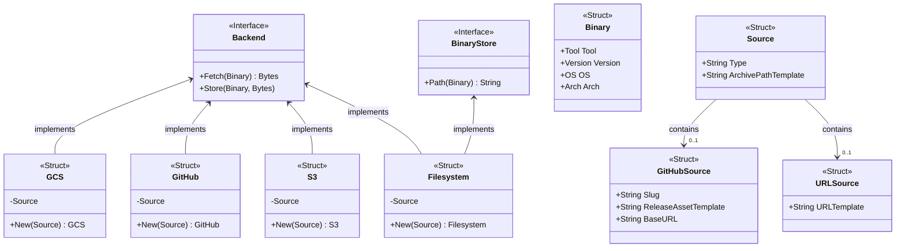

# Architecture overview

## Dataflows

## Type relationships

## Sources

Source are providers of tool binaries on a one-source-per-binary basis. They are strictly read-only resources. A source
is the main abstraction and translation layer that allows to bridge the gap between the widly varying storage and naming
schemes employed by each individual tool and `toolshare`'s well-defined internal schemes.

## Local cache

Because nobody wants to have to download a tool each time you run it, `toolshare` caches binaries locally in a folder
tree on a write-once basis.

## Remote cache

A remote cache is similar to a source in that it provides tool binaries. The difference lies in the fact that a remote
cache stores binaries for many different tools using `toolshare`'s well-defined internal schemes. It can be seen as a
copy of the local cache but available over a network rather than on a local disk.

Using a remote cache does not replace the local cache. It is instead used as a secondary cache. If a tool is not
available in the local cache it is fetched from the remote cache. If it's also not available in the remote cache it is
fetched from the source, if one is specified.

> NOTE: Using a remote cache is entirely optional and is mainly intended for use in the context of an organisation-wide
> deployment of `toolshare`. In such cases the remote cache may be:
>
> * stored on an office-based NFS share or server to improve download speed and latency.
> * used to store internal tools that are not published to sources available over the public internet.
> * used because the internet-connectivity necessary to reach sources is restricted or unavailable (air-gapped
>   environment).
> * controlled by a team that performs validation of tools before allowing their use and disables the use of public
>   sources via a centrally managed system-level configuration of `toolshare`.

## State

A toolshare state allows for central management of:

* recommended versions when a tool is not pinned
* a deny-list of specific tool versions (e.g due to known vulnerabilities)

Read [the detailed documentation](./state.md) for more information.

> NOTE: Using a state is entirely optional and is mainly intended for use in the context of an organisation-wide
> deployment of `toolshare`.
